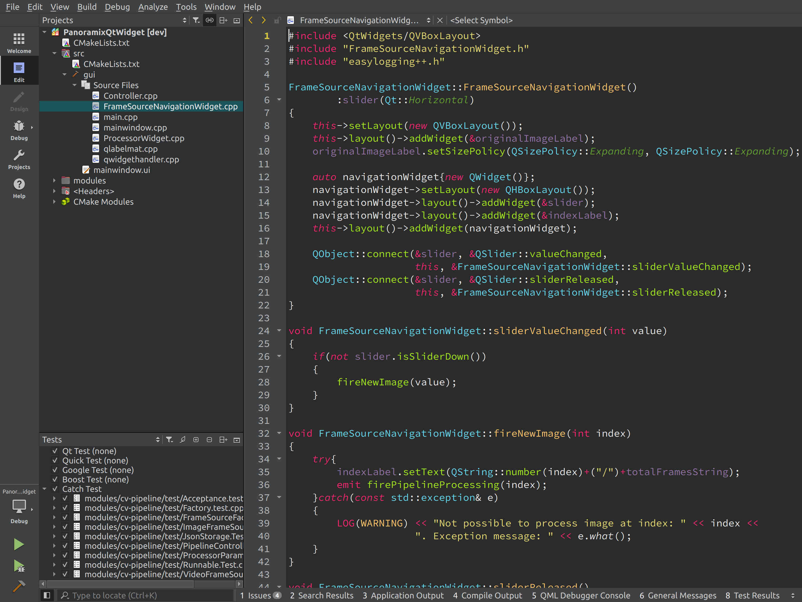

#### Monokai color theme for Qt Creator
My version of Monokai scheme colors for QtCreator.

#### Screenshot



#### Installation

Copy the `monokai.xml` file into the styles directory:

```bash
%QtInstallDir%/Tools/QtCreator/share/qtcreator/styles
```

In Qt Creator go to _Tools -> Options -> Text Editor -> Font & Colors_ and
select Monokai under "Color Scheme".
